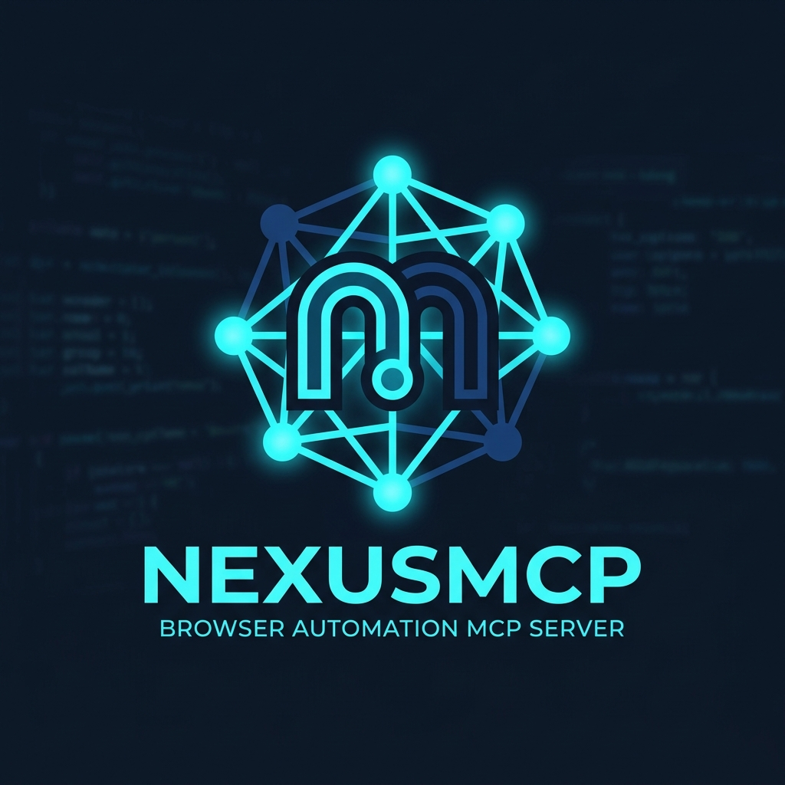
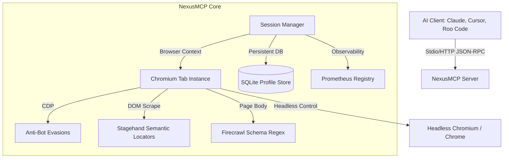

<p align="center">
  
</p>

<h1 align="center">⚡ NexusMCP ⚡</h1>

<p align="center">
  <strong>The lightest, fastest, and most robust enterprise-grade browser Model Context Protocol (MCP) server for AI agents.</strong>
</p>

<p align="center">
  
  
  
  
</p>

<p align="center">
  Developed & Maintained by <strong><a href="https://github.com/SanthaKumar-K-2004">Santhakumar K</a></strong>
</p>

---

## 📖 Table of Contents
1. [⚡ Quick Start: One-Command Setup](#-quick-start-one-command-setup)
2. [🎯 Features & Capabilities](#-features--capabilities)
3. [🏗️ Architecture Flow](#️-architecture-flow)
4. [🛠️ Client Configuration](#️-client-configuration)
5. [💻 Manual Installation](#-manual-installation)
6. [📈 Prometheus Observability](#-prometheus-observability)
7. [🤝 Developed By](#-developed-by)
8. [📄 License](#-license)

---

## ⚡ Quick Start: One-Command Setup

NexusMCP comes with an **automatic zero-config installer** (`setup.py`). It compiles the release binary, auto-detects configuration directories, and safely updates settings for **Claude Desktop, Cursor, and VS Code (Cline/Roo Code)** without disrupting existing MCP setups.

Run this simple command in your terminal:

```bash
git clone https://github.com/SanthaKumar-K-2004/NexusMcp.git && cd NexusMcp && python3 setup.py
```

---

## 🎯 Features & Capabilities

NexusMCP replaces slow, heavy, mock-based browser integrations with a **native Rust DevTools engine**:

- 🌐 **100% Real Browser Control**: Leverages actual headless Chromium/V8 instances via Chrome DevTools Protocol (`headless_chrome`).
- 🛡️ **Anti-Bot & Stealth Engine**: Spoofs `navigator.webdriver`, User-Agents, locale, and timezone settings on document load to evade Cloudflare, Akamai, and web application firewalls.
- 🩺 **Self-Healing Navigation**: Retries with rotative User-Agents and automated CDP stealth scripts if a block or CAPTCHA is detected.
- 🎯 **Stagehand Semantic Locators**: Evaluates element selectors dynamically based on weighted parameters (placeholder, accessibility labels, class, name) to locate target elements using natural language.
- 🕷️ **Structured Firecrawl-style Extraction**: Extract emails, prices, links, and schema-specific details using high-speed compiled regular expressions.
- 💾 **SQLite Profiles**: Secure cookie and configuration persistence across browsing sessions.
- 📊 **Observability & Metrics**: Exposes Prometheus metrics (`active_sessions`, `navigation_counter`, `page_load_time_seconds`) out of the box.

---

## 🏗️ Architecture Flow



---

## 🛠️ Client Configuration

### 1. Claude Desktop & VS Code (Cline / Roo Code)
The setup script completes this automatically. The generated JSON configuration looks like this:

```json
{
  "mcpServers": {
    "nexusmcp": {
      "command": "/absolute/path/to/nexusmcp/target/release/nexusmcp",
      "args": ["mcp", "--stealth"]
    }
  }
}
```

### 2. Cursor
1. Navigate to **Settings** ➡️ **Cursor Settings** ➡️ **Features** ➡️ **MCP**.
2. Click **+ Add New MCP Server**.
3. Apply the parameters:
   - **Name**: `nexusmcp`
   - **Type**: `command`
   - **Command**: `/absolute/path/to/nexusmcp/target/release/nexusmcp`
   - **Arguments**: `mcp --stealth`

---

## 💻 Manual Installation

```bash
# 1. Compile release binary
cargo build --release

# 2. Run MCP stdio server
./target/release/nexusmcp mcp --stealth

# 3. Or run as standalone HTTP server
./target/release/nexusmcp serve --port 3000 --stealth
```

---

## 📈 Prometheus Observability

NexusMCP exposes a Prometheus scraper endpoint on HTTP server mode:

```bash
curl http://localhost:3000/metrics
```

Available metrics:
*   `nexusmcp_active_sessions`: Gauge of currently active Chromium tabs.
*   `nexusmcp_navigation_counter`: Total page navigations triggered.
*   `nexusmcp_page_load_time_seconds`: Page load time durations histogram.

---

## 🤝 Developed By

Designed, written, and maintained by **[Santhakumar K](https://github.com/SanthaKumar-K-2004)**. Contributions, bug reports, and pull requests are welcome!

---

## 📄 License

Apache 2.0 License.