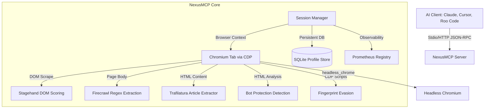

<p align="center">
  
</p>

<h1 align="center">⚡ NexusMCP ⚡</h1>

<p align="center">
  <strong>A lightweight browser MCP server for AI agents, built in Rust.</strong>
</p>

<p align="center">
  
  
  
  
</p>

<p align="center">
  Developed & Maintained by <strong><a href="https://github.com/SanthaKumar-K-2004">Santhakumar K</a></strong>
</p>

---

## What This Is

NexusMCP is a **Model Context Protocol (MCP) server** that gives AI agents (Claude, Cursor, etc.) real browser control via headless Chromium. It uses the `headless_chrome` crate to drive a real browser through the Chrome DevTools Protocol.

### What Works Today

| Feature | Status | How |
|---------|--------|-----|
| **Real browser navigation** | ✅ Working | `headless_chrome` → Chromium CDP |
| **Real JavaScript execution** | ✅ Working | `tab.evaluate()` via CDP |
| **Real click / form fill** | ✅ Working | `tab.find_element()` → `.click()` / `.type_into()` |
| **Real screenshot (PNG)** | ✅ Working | `tab.capture_screenshot()` |
| **Real PDF generation** | ✅ Working | `tab.print_to_pdf()` |
| **Real page content → Markdown** | ✅ Working | `tab.get_content()` → `html2md` |
| **Real link extraction** | ✅ Working | `scraper` on live DOM |
| **Back / Reload / Tabs** | ✅ Working | CDP `history.back()`, `tab.reload()`, `browser.new_tab()` |
| **Element wait (selector/text)** | ✅ Working | `tab.wait_for_element_with_custom_timeout()` |
| **Structured data extraction** | ✅ Working | Firecrawl-style regex + scraper on live HTML |
| **Semantic element finding** | ✅ Working | Stagehand-style weighted DOM scoring |
| **Article content extraction** | ✅ Working | Trafilatura-style boilerplate stripping via scraper |
| **Bot protection detection** | ✅ Working | Crawl4AI-style HTML marker analysis |
| **Stealth fingerprint injection** | ✅ Working | CDP scripts: webdriver, UA, WebGL, plugins |
| **Profile persistence (SQLite)** | ✅ Working | Create/load profiles with rusqlite |
| **Prometheus metrics** | ✅ Working | `nexusmcp_navigations_total`, `active_sessions`, `page_load_time_seconds` |
| **MCP stdio server** | ✅ Working | JSON-RPC 2.0 over stdin/stdout |
| **HTTP server** | ✅ Working | Axum on configurable port |
| **Page observation (DOM analysis)** | ✅ Working | Inventories forms, inputs, buttons, links on live page |
| **Self-healing navigation** | ✅ Working | Retries with escalating stealth if bot protection detected |

### What Is NOT Implemented Yet (Roadmap)

- **Cookie persistence** across sessions (profile stores metadata only, not cookies)
- **Proxy rotation** (config accepted but not wired to browser launch)
- **Multi-tab management** (currently drives one tab per session)
- **AI/LLM-powered element understanding** (Stagehand uses DOM scoring, not vision/LLM)
- **Real CAPTCHA solving** (detection works, but solving requires external service)

---

## Quick Start

```bash
git clone https://github.com/SanthaKumar-K-2004/NexusMcp.git && cd NexusMcp && python3 setup.py
```

Or manually:

```bash
cargo build --release
./target/release/nexusmcp mcp --stealth        # MCP stdio mode
./target/release/nexusmcp serve --port 3000     # HTTP server mode
```

---

## Architecture



---

## Available Tools (27 total)

| Tool | Description |
|------|-------------|
| `browser_navigate` | Navigate to a URL with stealth and retry |
| `browser_evaluate` | Execute JavaScript via CDP |
| `browser_click` | Click an element by CSS selector |
| `browser_fill_form` | Fill form fields (selector → value) |
| `browser_wait_for` | Wait for element/text/timeout |
| `browser_back` | Navigate back in history |
| `browser_reload` | Reload current page |
| `browser_tab_new` | Open a new tab |
| `browser_tab_switch` | Switch to a tab by ID |
| `browser_tab_close` | Close current tab |
| `browser_markdown` | Extract Markdown from live page |
| `browser_screenshot` | Capture PNG screenshot |
| `browser_pdf` | Generate PDF of current page |
| `browser_links` | Extract all links from page |
| `browser_extract` | Extract structured data |
| `browser_firecrawl_extract` | Schema-driven extraction (emails, prices, etc.) |
| `browser_find_element` | Natural language element targeting |
| `browser_trafilatura` | Article content extraction |
| `browser_observe` | DOM analysis — inventory interactive elements |
| `browser_act` | Goal-directed action (find + click/type) |
| `browser_stealth_rotate` | Rotate browser fingerprint via CDP |
| `browser_create_profile` | Create persistent profile (SQLite) |
| `browser_load_profile` | Load profile by ID |
| `browser_smart_retry` | Retry with escalating stealth |
| `browser_handle_captcha` | Detect bot protection |
| `browser_health_check` | Server health status |
| `browser_research` | Parallel HTTP fetch multiple URLs |

---

## Client Configuration

### Claude Desktop / VS Code (Cline / Roo Code)

The `setup.py` script handles this automatically. The config looks like:

```json
{
  "mcpServers": {
    "nexusmcp": {
      "command": "/path/to/nexusmcp/target/release/nexusmcp",
      "args": ["mcp", "--stealth"]
    }
  }
}
```

### Cursor

Settings → Cursor Settings → Features → MCP → Add New MCP Server:
- **Name**: `nexusmcp`
- **Type**: `command`
- **Command**: `/path/to/nexusmcp/target/release/nexusmcp`
- **Arguments**: `mcp --stealth`

---

## Prometheus Metrics

```bash
curl http://localhost:3000/metrics
```

- `nexusmcp_active_sessions` — current active browser sessions
- `nexusmcp_navigations_total` — total page navigations
- `nexusmcp_page_load_time_seconds` — page load time histogram

---

## Running Tests

```bash
cargo test --test integration_tests -- --nocapture
```

---

## License

Apache 2.0 License.